# Разделы
  - [Подготовительные мероприятия. Настройка сетевой инфраструктуры стенда](#подготовительные-мероприятия-настройка-сетевой-инфраструктуры-стенда)
  - [Задание 1. Настройка сетевой инфраструктуры корпоративной сети. Установка компонентов защищенной сети](#задание-1-настройка-сетевой-инфраструктуры-корпоративной-сети-установка-компонентов-защищенной-сети)
    - [Задача 1.1. Настройка сетевого окружения рабочих станций](#задача-11-настройка-сетевого-окружения-рабочих-станций)
    - [Задача 1.2. Развертывание ПК Administrator в качестве центра сертификации](#задача-12-развертывание-пк-administrator-в-качестве-центра-сертификации)
    - [Задача 1.3. Установка ПО VPN Client на рабочее место администратора и для организации сети филиала](#задача-13-установка-по-vpn-client-на-рабочее-место-администратора-и-для-организации-сети-филиала)
  - [Задание 2. Создание структуры защищенной сети](#задание-2-создание-структуры-защищенной-сети)
    - [Задача 2.1. Развертывание защищенной сети и распределение ролей](#задача-21-развертывание-защищенной-сети-и-распределение-ролей)
    - [Задача 2.2. Создание структуры защищенной сети в ЦУС и генерация ключей в УКЦ](#задача-22-создание-структуры-защищенной-сети-в-цус-и-генерация-ключей-в-укц)
    - [Задача 2.3. Инициализация VPN Coordinator](#задача-23-инициализация-vpn-coordinator)
    - [Задача 2.4. Проверка защищенного взаимодействия (Деловая почта и Чат)](#задача-24-проверка-защищенного-взаимодействия-деловая-почта-и-чат)
  - [Задание 3. Реализация межсетевого взаимодействия защищённых сетей](#задание-3-реализация-межсетевого-взаимодействия-защищённых-сетей)
  - [Задание 4. Настройка правил фильтрации трафика](#задание-4-настройка-правил-фильтрации-трафика)
    - [Задача 4.1. Разрешение подключения к веб-интерфейсу координатора Net1-Coord от Net1-Open](#задача-41-разрешение-подключения-к-веб-интерфейсу-координатора-net1-coord-от-net1-open)
    - [Задача 4.2. Запрет доступа к интернет-ресурсам vk.com и ok.ru на координаторе Net1-Coord](#задача-42-запрет-доступа-к-интернет-ресурсам-vkcom-и-okru-на-координаторе-net1-coord)
    - [Задача 4.3. Разрешение доступа по SSH к координатору Net1-Coord от узла Net2-Client](#задача-43-разрешение-доступа-по-ssh-к-координатору-net1-coord-от-узла-net2-client)
  - [Задание 5. Настройка туннелирования в рамках межсетевого взаимодействия](#задание-5-настройка-туннелирования-в-рамках-межсетевого-взаимодействия)
    - [Шаг 5.1. Настройка туннелирования в ЦУС 1 (на Admin-IB)](#шаг-51-настройка-туннелирования-в-цус-1-на-admin-ib)
    - [Шаг 5.2. Настройка туннелирования в ЦУС 3 (на Net3-Admin)](#шаг-52-настройка-туннелирования-в-цус-3-на-net3-admin)
    - [Шаг 5.3. Межсетевой обмен обновленной информацией и рассылка справочников](#шаг-53-межсетевой-обмен-обновленной-информацией-и-рассылка-справочников)
    - [Шаг 5.4. Настройка транзитных правил сетевого экрана для туннелируемого трафика](#шаг-54-настройка-транзитных-правил-сетевого-экрана-для-туннелируемого-трафика)
    - [Шаг 5.5. Проверка функционирования туннелирования (ICMP ping)](#шаг-55-проверка-функционирования-туннелирования-icmp-ping)

## Подготовительные мероприятия. Настройка сетевой инфраструктуры стенда

### Задача 1.1. Настройка сетевого окружения рабочих станций
Необходимо выбрать общую папку, которая будет использоваться для передачи информации между виртуальными машинами и хостом. Для этого следует перейти в **настройки ВМ**, выбрать раздел **Options**. Во вкладке **Shared Folders** выбрать режим **Always enabled**, затем нажать кнопку **Add** для добавления общей папки:

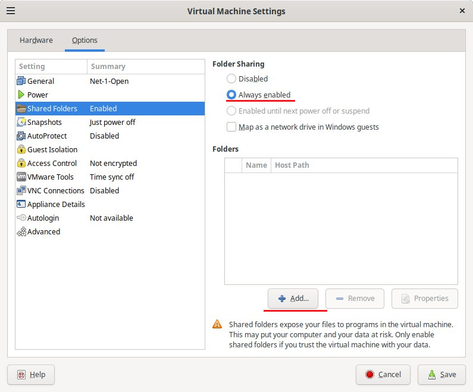

Здесь укажите **имя папки** и **путь к ней**, должен быть установлен атрибут **Enabled**:

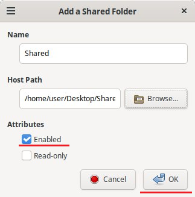

Результат выполнения описанных действий должен выглядеть так:

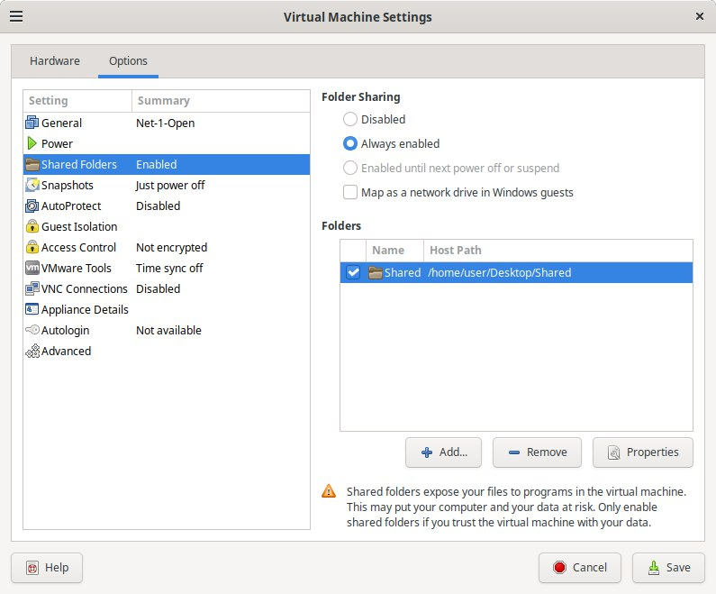

> Добавить общую папку необходимо для **всех ВМ** под управлением **Windows 10** (все машины за исключением координаторов)!

Далее необходимо перейти в **Панель управления => Сеть и интернет => Центр управления сетями и общим доступом => Изменение параметров адаптера**, нажать правой кнопкой мыши на сетевой адаптер, перейти в его **Свойства**, в пункте **IP версии 4 (TCP/IPv4)** произвести конфигурацию сетевого адаптера в соответствии с таблицей сетевых параметров, представленной в дополнительных материалах. Пример сетевой конфигурации для Net1-Open:

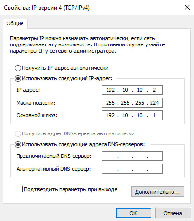

> Произвести сетевую конфигурацию нужно для **всех ВМ** под управлением **Windows 10**!

Вернитесь в **Центр управления сетями и общим доступом** и перейдите в пункт **Изменить дополнительные параметры общего доступа**. Здесь необходимо перевести все тумблеры в положение **Включено**, как показано ниже:

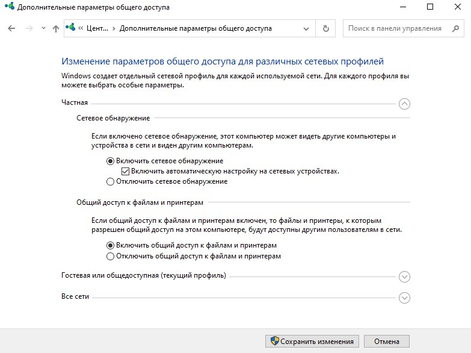

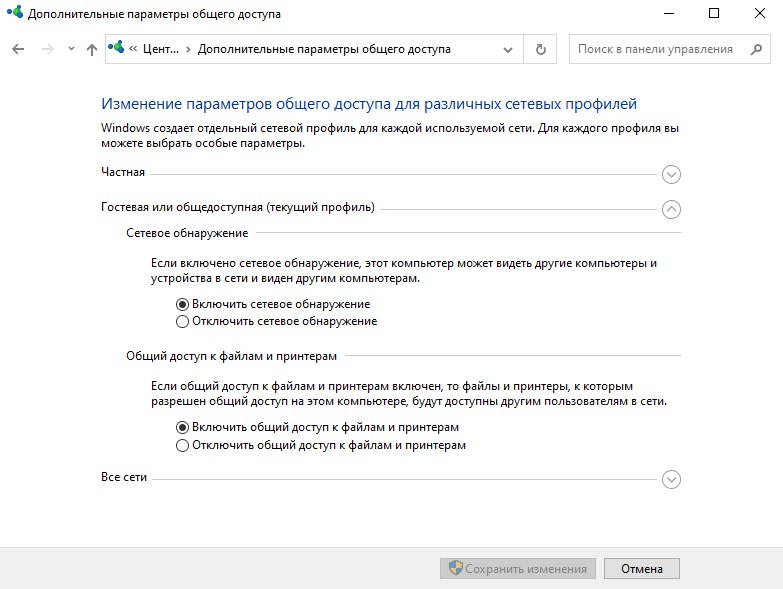

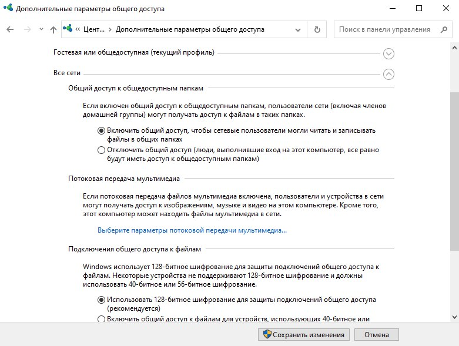

Перейдите **Панель управления => Система и безопасность => Брандмауэр Защитника Windows => Включение и отключение брандмауэра Защитника Windows**. Переведите оба тумблера в режим **Отключено**:

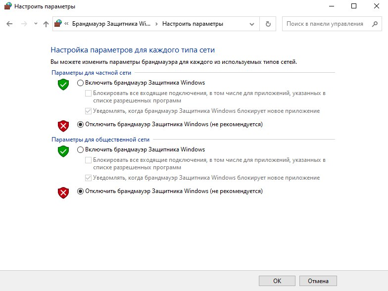

> Повторите действие на **всех ВМ** под управлением **Windows 10**

> Отключение брандмауэра необходимо, чтобы исключить **вероятность ошибки** на более поздних стадиях проектирования защищенной сети.

Перейдите в **Панель управления => Система и безопасность => Электропитание => Настройка отключения дисплея**. В обоих выпадающих списках выберите режим **Никогда**:

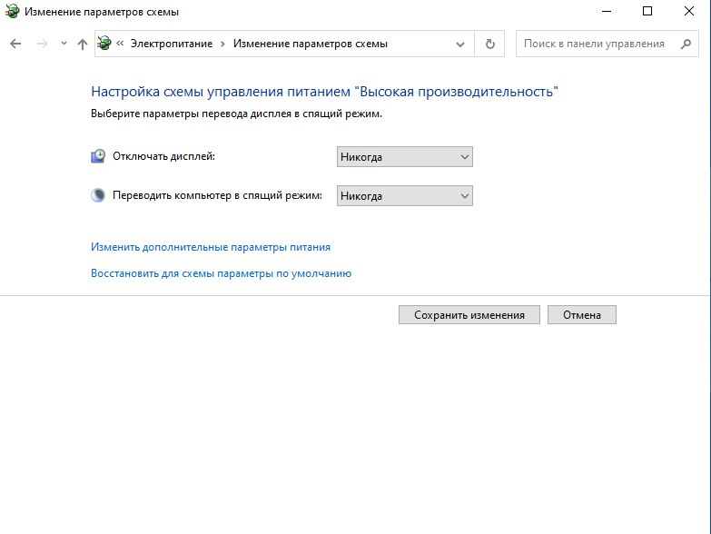

В заключение подготовительного этапа необходимо проверить **сетевую доступность** между виртуальными машинами в своих сетях с помощью утилиты командной строки **ping**:

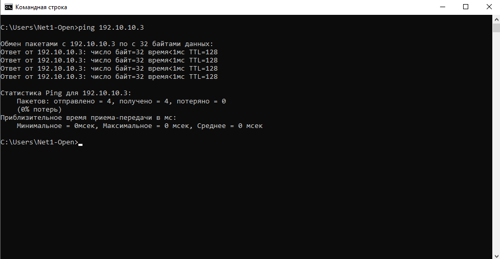

## Задание 1. Настройка сетевой инфраструктуры корпоративной сети. Установка компонентов защищенной сети

### Задача 1.2. Развертывание ПК Administrator в качестве центра сертификации
#### Текст задания:
> Установить и настроить рабочее место администратора (на базе виртуальной
машины Net1-Admin (ЦО)): Центр управления сетью (серверное и клиентское
приложение ЦУС), Удостоверяющий и ключевой центр (УКЦ).

> Действия, описанные в данном разделе, происходят на ВМ **Net1-Open**.

В **проводнике Windows** перейдите в раздел **Сеть**. Здесь будет находиться общая сетевая папка, созданная на этапе подготовки. Если вы делали все так же, как описано выше, общая папка будет располагаться по пути **\\\vmware-host\Shared Folders\Shared**.

В сетевой папке найдите установочный дистрибутив **SQL Server 2014**. Ниже расположен **относительный путь** до установочного дистрибутива:

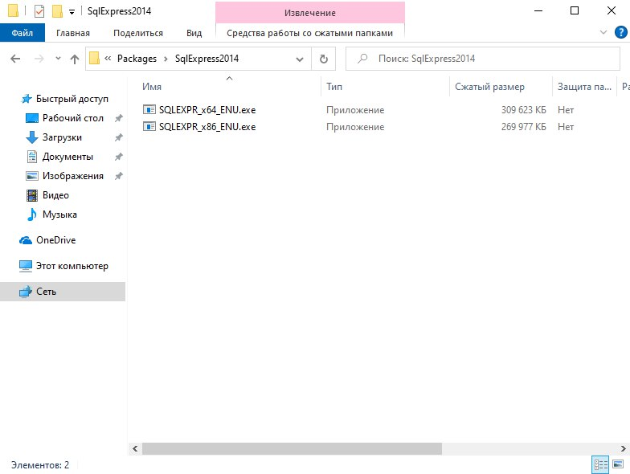

> .\Программное обеспечение\ViPNet Administrator.zip\Soft\Центр управления сетью\Server Install\Packages\SqlExpress2014\SQLEXPR_x64_ENU.exe

Распакуйте **64-разрядный** дистрибутив на **рабочий стол** и запустите его. В окне ниже представлен путь для распаковки файлов установки. Его можно оставить по умолчанию:

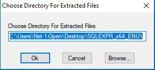

После распаковки временных файлов автоматически запустится **Установочный центр**. В открывшемся окне нажмите **New SQL Server...**:

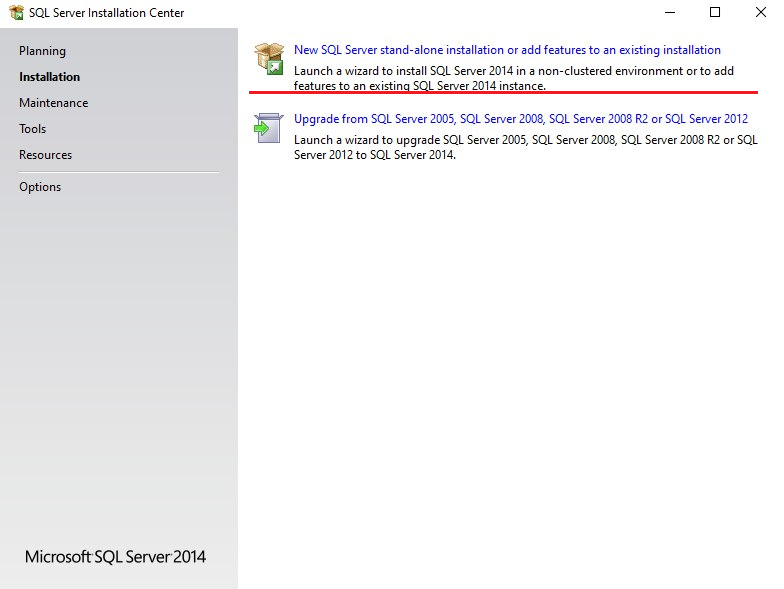

Примите **пользовательское соглашение**, оставив галочку напротив соответствующего пункта:

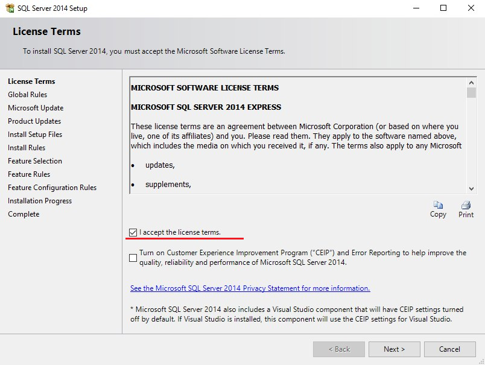

Использовать обновления Microsoft для проверки обновлений **не нужно**:

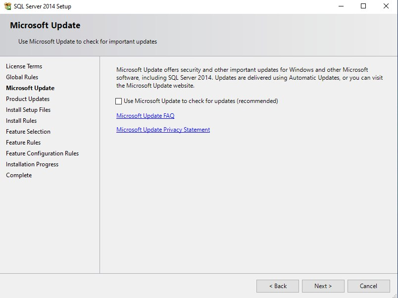

Не обращайте внимание на описанную установщиком ошибку:

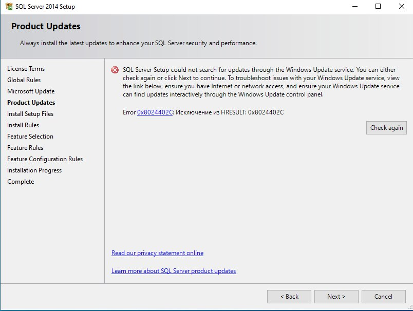

Устанавливать необходимо **полный комплект ПО**, предлагаемый установщиком, поэтому галочки убирать **не нужно**:

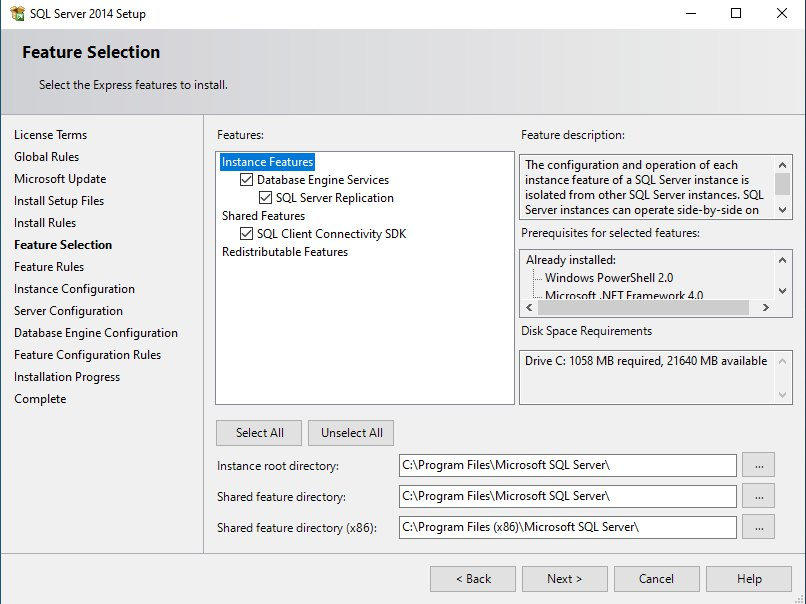

При создании нового **Instance** необходимо указать имя **WINNCCSQL** (это имя используется по умолчанию продуктом ViPNet Administrator):

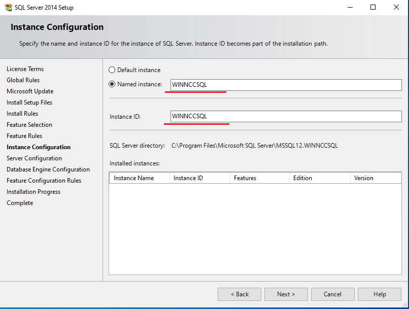

На следующем этапе установки выберите тип **Automatic** напротив графы **SQL Server Browser**:

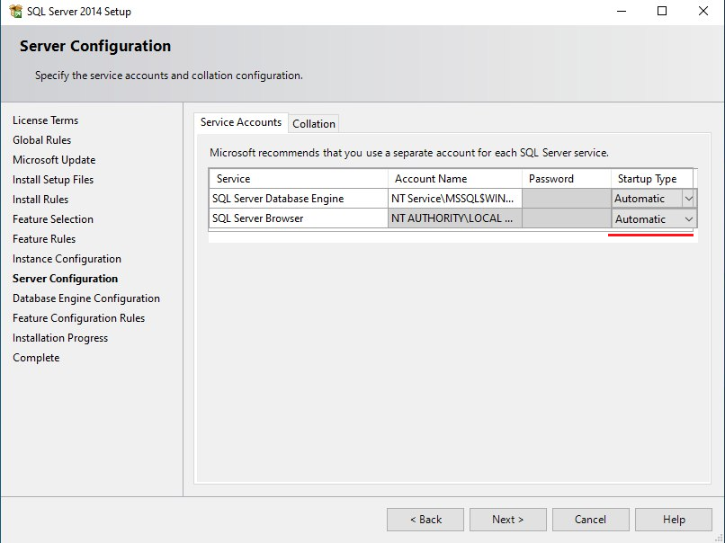

Необходимо выбрать пункт **Mixed Mode...** при выборе режима аутентификации, установить пароль **1234**. Не спешите здесь жать кнопку **Далее**:

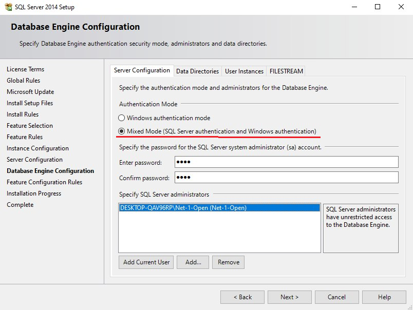

В разделе **FILESTREAM** необходимо проставить все галочки во избежание проблем на поздних этапах развертывания сети:

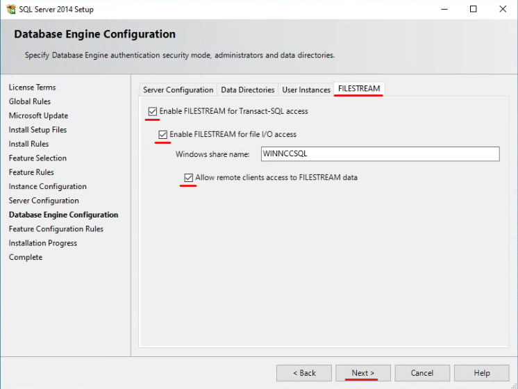

Если вы все сделали правильно, по завершении установки увидите все **зеленые галочки**:

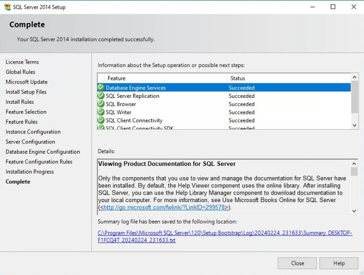

> Следующий пункт выполнения задания очень важен. Не игнорируйте его во избежание проблем с подключением к БД.

Необходимо в пуске найти **SQL Server 2014 Configuration Manager**, развернуть список **SQL Server Network Configuration** и во вкладке **Protocols for WINNCCSQL** включить **TCP/IP**:

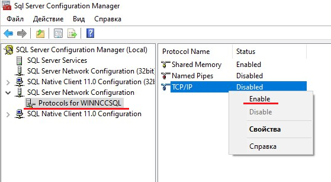

Будет получено предупреждение о том, что для применения изменений необходимо **перезапустить службу**:

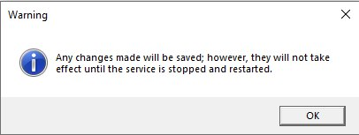

Для этого переходим во вкладку **SQL Server Services** и перезапускаем **SQL Server (WINNCCSQL)**:

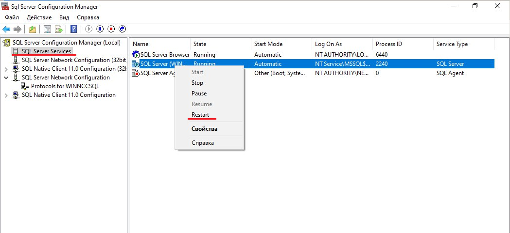

> Развертывание всех компонентов далее производится на ВМ **Net1-AdminCA** 

Для выполнения задания необходимо **полностью** распаковать содержимое архива по пути **\\\vmware-host\Shared Folders\Shared\Программное обеспечение\ViPNet Administrator.zip** на рабочий стол. "Полностью" значит, что на рабочем столе должна быть папка **Soft**.

После распаковки запустите установщик **ViPNet Administrator ЦУС (серверная часть)**.
> Путь до установщика: **C:\Users\Net-1-AdminCA\Desktop\Soft\Центр управления сетью\Server Install\Setup.exe**

Соглашаемся с установкой необходимых компонентов:

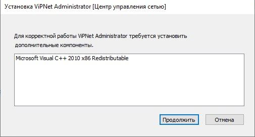

Выбираем язык программы **русский**:

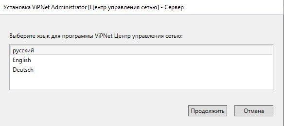

Принимаем **условия лицензионного соглашения**:

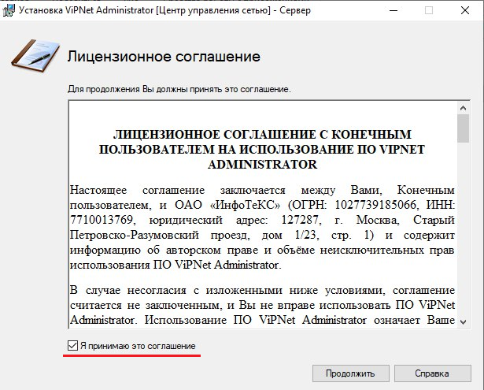

Следующим шагом необходимо проверить **доступность** базы данных. Если вы указывали IP-адреса в соответствии с **таблицей из дополнительных материалов**, тогда указывайте все ровно так, как на скриншоте:

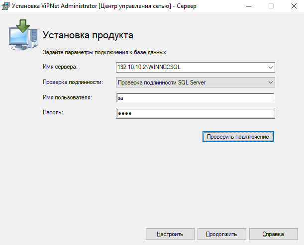

> Пароль от БД указать как при установке - **1234**

> Перед продолжением **обязательным шагом** является **проверка подключения к БД**

После нажатия кнопки **Установить сейчас** должна начаться установка продукта:

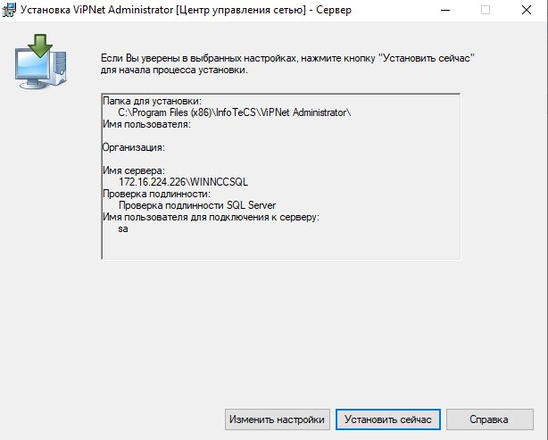

Если все сделано правильно, будет получено сообщение **Сервер успешно установлен**:

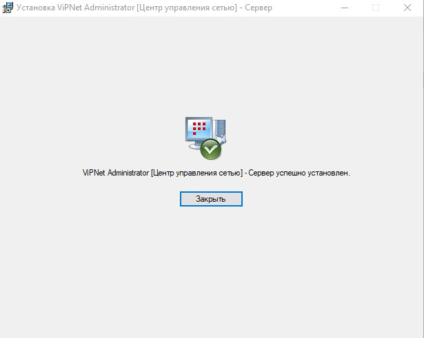

Для предотвращения проблем запуска **серверной части ЦУС** необходимо перейти в оснастку **Службы** через меню пуск или по имени **services.msc** в меню **Выполнить**:

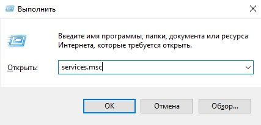

Здесь необходимо найти службу **NccService** и перейти в ее свойства:

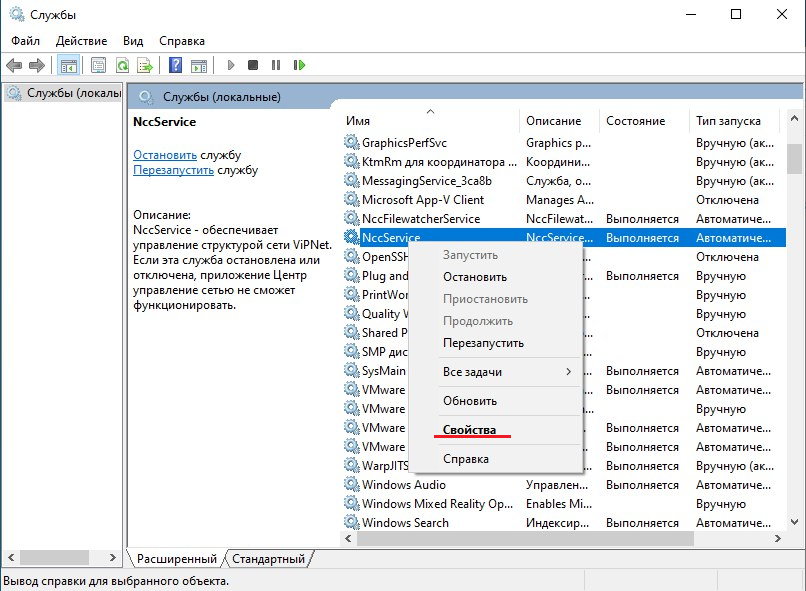

Обязательно меняем тип запуска на **Автоматический**:

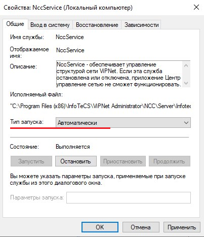

После нажатия кнопки **OK** необходимо перезапустить службу для применения изменений:


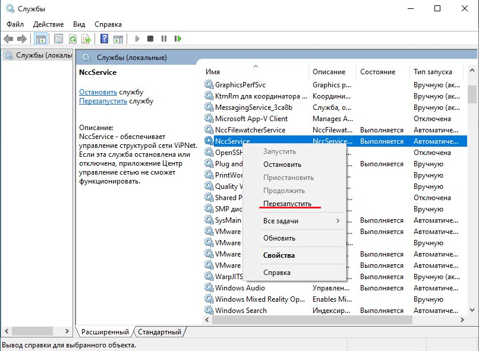

Так как работа службы **NccFilewatcherService** зависит от перезапускаемой нами службы, это службу нужно тоже перезапустить:

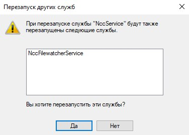

Следующий важный шаг - установка **ViPNet Administrator УКЦ**.
> Установщик расположен по пути: **C:\Users\Net-1-AdminCA\Desktop\Soft\Удостоверяющий и ключевой центр\Setup.exe**

Соглашаемся с лицензионным соглашением:

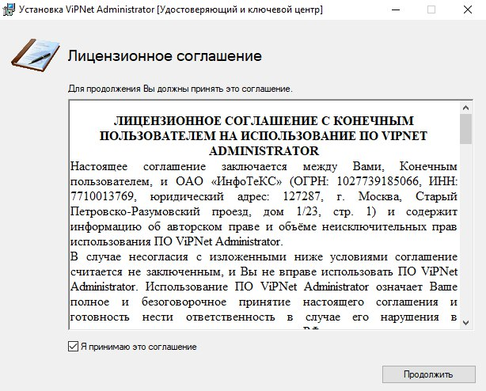

Ничего не изменяя, нажимаем кнопку **Установить сейчас**:

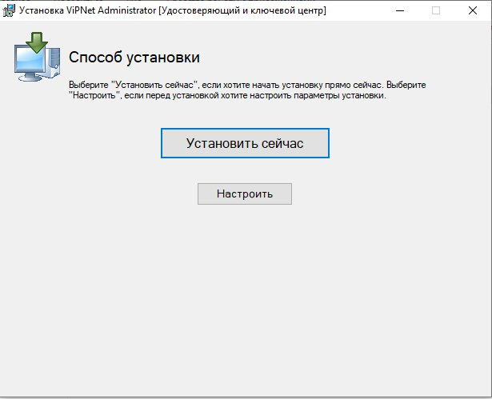

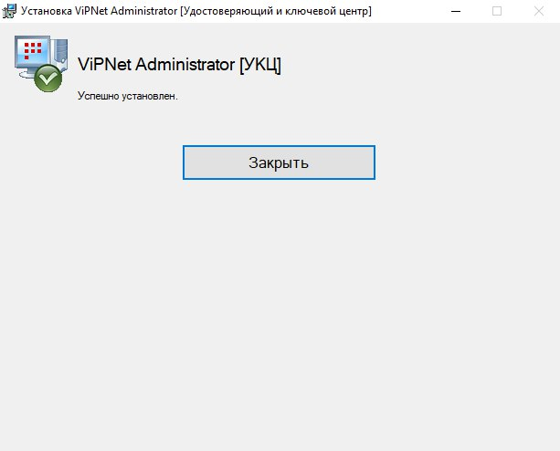

> Следующее действие производится на ВМ **Net1-Admin**

Распакуйте на рабочий стол папку по пути **\\\vmware-host\Shared Folders\Shared\Программное обеспечение\ViPNet Administrator.zip\Soft\Центр управления сетью\Client Install**

Запустите установщик из папки, выбрав **русский** язык:

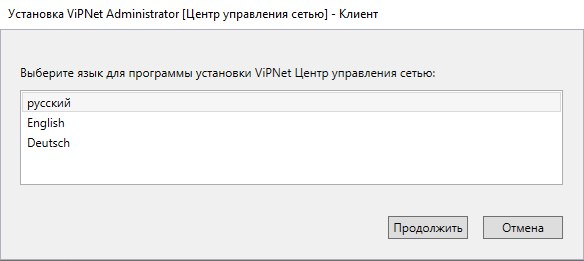

Примите условия лицензионного соглашения:

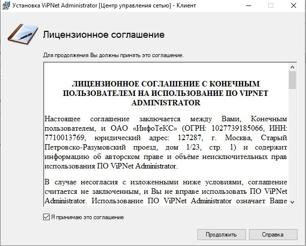

Не изменяя параметров установщика, нажмите кнопку **Установить сейчас**:

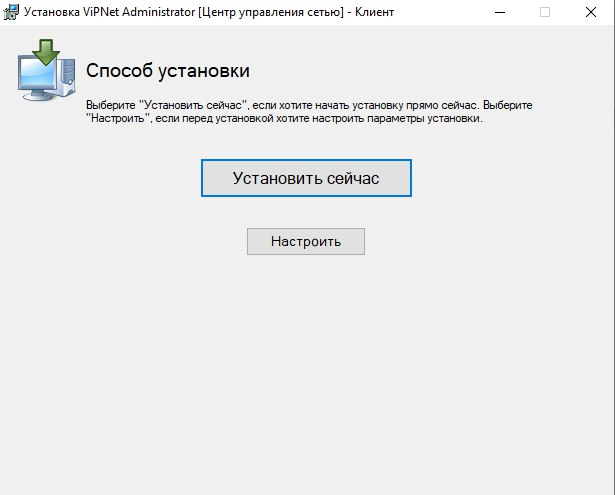

Если все сделано правильно, после запуска ЦУС сервер запросит **имя пользователя и пароль**:

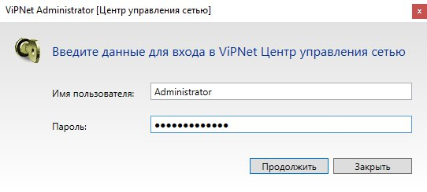
> - Имя пользователя: **Administrator** 
> - Пароль: **Administrator**

В следующем диалоговом окне задайте новый пароль **xxXX2244** (текущий пароль все еще **Administrator**):

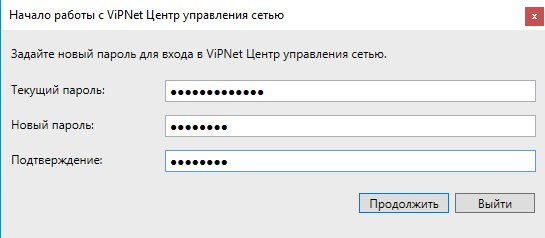

Выберите файл с лицензией, содержащий в себе число **14443**. Полное имя файла может отличаться:

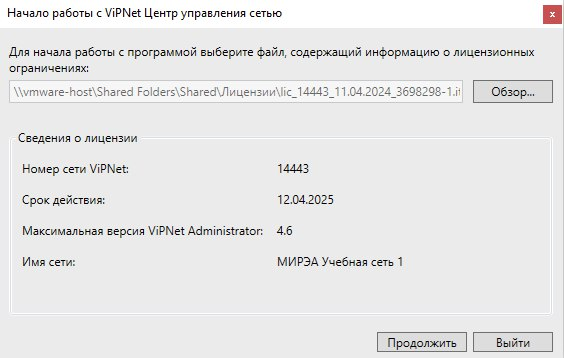
> Путь до лицензии в сетевой папке: **\\vmware-host\Shared Folders\Shared\Лицензии\lic_14443_11.04.2024_3698298-1.itcslic**

Если все сделано правильно, должно открыться меню **Начало работы с...** Не нажимая ничего, закрываем:

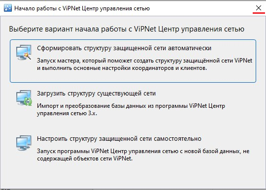

Запустите установленный нами ранее **ViPNet Administrator УКЦ**, выберите пункт **Настройка новой базы данных**:

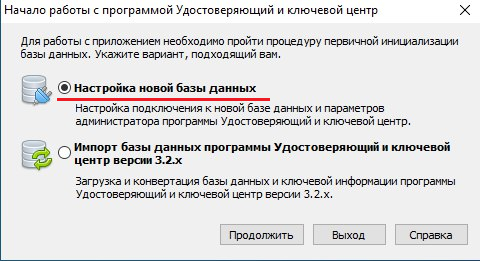

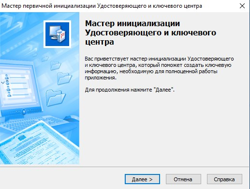

Вот здесь внимание! Не надо **ждать** загрузки. Инициализация происходит только во время **движения курсора мыши** и **нажатия любых клавиш** на клавиатуре:

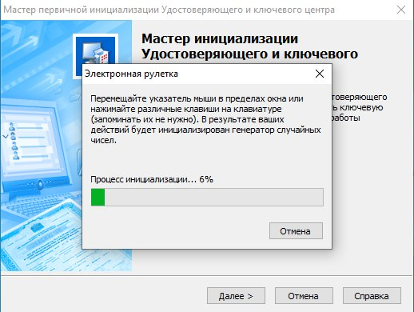


После инициализации укажите **IP-адрес** базы данных и имя **Instance**, как на скриншоте ниже, либо в соответствии с вашими настройками адресации:

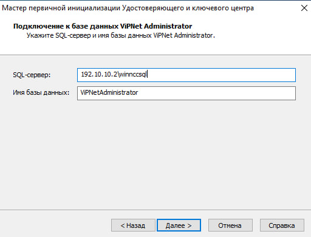

**Имя и пароль** пользователя оставить **стандартными**:


Далее все, как на скриншотах. Мы **не меняем параметры сертификата**:


Здесь меням **Время бездействия админстратора** на срок **30 минут**:


На данном этапе **инициализации УКЦ** необходимо выбрать **Собственный пароль**. Это очень важно!


> Путь к файлу XPS: **C:\ProgramData\InfoTeCS\ViPNet Administrator\KC\Export\Autentification Users**

Задайте пароль администратора **xxXX2244**:


Если все выполнено правильно, в завершение процесса будет получено сообщение **Инициализация успешно завершена**:


### Задача 1.3. Установка ПО VPN Client на рабочее место администратора и для организации сети филиала
#### Текст задания:
> На виртуальной машине Net1-Admin (ЦО) установить ПО Client
(Пользовательская или серверная ОС), рабочее место администратора;
На виртуальной машине Net2-Client (филиал) установить ПО Client, рабочее
место пользователя.

> Выполнение задачи производится на ВМ **Net1-Admin**

Для выполнения этой задачи распакуйте установщик по пути **\\\vmware-host\Shared Folders\Shared\Программное обеспечение\Client 4.x.zip\client_RUS_4.5.1.57252.exe** на рабочий стол.

> Перед запуском установщика следует **перезагрузить** ВМ. Данное правило действует только для **Net1-Admin**, **Net3-Admin**.

После перезагрузки запустите установщик и примите условия лицензионного соглашения:


После завершения работы **мастера установки** нажмите кнопку **Перезагрузить сейчас**:


После перезагрузки должно появиться **уведомление об отсутствии ключей**. Мы знаем об этом, поэтому на данном этапе **отказываемся** установить ключи сейчас:


Повторите установку **ПО ViPNet Client** на **Net2-Client**.

## Задание 2. Создание структуры защищенной сети

### Задача 2.1. Развертывание защищенной сети и распределение ролей
#### Текст задания:
> Необходимо использовать рабочее место администратора (созданное ранее)
для создания структуры защищенной сети, развернуть с помощью технологии
виртуальных машин сеть предприятия и настроить необходимые АРМ в
соответствии с заданными ролями.
В итоге выполнения задания должны быть развернуты и настроены
следующие сетевые узлы защищенной сети (см. таблицу 1).

#### Таблица 1 - Узлы защищенной сети 
| Вирт. машина         | Название сетевого узла  | ПО ОС сетевого узла                                   | ОС сетевого узла                  | Имя пользователя сетевого узла |
|----------------------|-------------------------|-------------------------------------------------------|-----------------------------------|--------------------------------|
| Net1-Admin (ЦО)      | Администратор сети      | Administrator (БД, ЦУС сервер и клиент, УКЦ), Client  | Пользовательская или серверная ОС | AdmN                           |
| Net1-Coord (ЦО)      | Координатор офиса       | Coordinator                                           | HW-VA                             | CoordO                         |
| Net2-Coord (Филиал)  | Подчиненный координатор | Coordinator                                           | HW-VA                             | CoordB                         |
| Net2-Client (Филиал) | Пользователь филиала    | Client                                                | Пользовательская или серверная ОС | UserB                          |

Все сетевые узлы развернуты в соответствии с таблицей 1, а ПО установлено. Поэтому можно переходить к выполнению следующей задачи.

### Задача 2.2. Создание структуры защищенной сети в ЦУС и генерация ключей в УКЦ
#### Текст задания:
> Необходимо создать в ЦУС структуру защищенной сети в соответствии с
заданной схемой, представленной на рисунке 1. Создать пользователей узлов
и их связи в соответствии со схемой, представленной в таблице 2.
Провести инициализацию УКЦ, поменять тип паролей для пользователей
(«собственный»). Сформировать дистрибутивы ключей для всех сетевых
узлов. Разнести дистрибутивы ключей по АРМ, провести первичную
инициализацию узлов защищенной сети, проверить доступность узлов
защищенной сети и сделать скриншоты работоспособности узлов. 

#### Таблица 2 - Схема связей пользователей
| Пользователь | CoordO | AdmN | CoordB | UserB |
| -------------|--------|------|--------|-------|
| CoordO       | ×      | *    | *      |       |
| AdmN         | *      | ×    |        | *     |
| CoordB       | *      |      | ×      | *     |
| UserB        |        | *    | *      | ×     |

Перейдите в **ЦУС** на **Net1-Admin**, в меню **Координаторы** нажмите зеленый плюс для создания **нового координатора**:


В сети **14443** будет всего 2 координатора, создайте их по очереди. Обязательно **снимите** галочку с пункта **Создать одноименного пользователя на на новом узле автоматически**:


После создания координаторов меню должно выглядеть следующим образом:


Перейдите в меню **Клиенты** и аналогично создайте новых клиентов.

> Первым **ОБЯЗАТЕЛЬНО** создается **администратор сети** (в любой сети), в противном случае придется выполнять **ДЭ** заново!


Меню после создания **клиентов**:


Для **каждого** из координаторов и клиентов создайте **пользователей** по примеру ниже. В качестве сетевого узла указываются как клиенты, так и координаторы в соответствии с **таблицей 1**:


Меню пользователей после выполненных действий должно выглядеть вот так:


Снова перейдите в меню координаторов, разверните **Координатор офиса** и создайте **Межсерверный канал**, нажав кнопку **Добавить**:


Выберите единственный координатор из списка и нажмите **Добавить**:


Перейдите в **Роли узла** и удалите все существующие роли:


Добавьте узлу роль **Coordinator HW-VA**:


Перейдите в раздел меню **Адреса во внешних сетях**. Укажите **IP-адреса** в соответствии с таблицей сетевых параметров из **Дополнительных материлов**. Для **MFTP** используйте адрес **ВНУТРЕННЕЙ** сети (сеть, обращенная к клиентам):


> В случае невыполнения этого пункта для всех координаторов и клиентов защищенные узлы не смогут найти друг друга и установить соединение!

Теперь разверните **Координатор филиала**. **Межсерверный канал** уже будет создан автоматически. Проделайте аналогичные действия, включая **присвоение роли узла** и **назначение адресов во внешних сетях**. **Адреса во внешних сетях** для **Координатора филиала**:


Для **обоих клиентов** так же назначьте **Адреса во внешних сетях** в соответствии с таблицей сетевых параметров из дополнительных материалов:


Для каждого из **ПОЛЬЗОВАТЕЛЕЙ** необходимо добавить связи в соответствии с **таблицей 2**. Пример создания связей для пользователя **AdmN**:


> Указывайте связи правильно, иначе впоследствии не получится удостовериться в качестве соединения с другими защищенными узлами!

Создайте справочники:


На **Net1-Admin** перейдите в **УКЦ** (вкладка **Сетевые узлы**). В свойствах **каждого из координаторов** задайте пароль администратора по примеру:


> Пароль - **xxXX2244** 

Выделите **все сетевые узлы** и **выдайте новый дистрибутив ключей**:


Оставляйте все поля по умолчанию, кроме пароля! Пароль - **xxXX2244**


> Повторить описанные действия для каждого сетевого узла!

После настройки последнего сетевого узла должен открыться проводник в папке, содержащей **дистрибутивы ключей**:


> Путь к папке - **C:\\ProgramData\\InfoTeCS\\ViPNet Administrator\\KC\\Export\\Dst for network 14443**

Для удобства можно создать ярлык на рабочем столе:


> Перенесите **дистрибутивы ключей** в общую сетевую папку для дальнешего распространения по клиентам и координаторам.

Откройте установленный **ViPNet Client** на **Net1-Admin**:


Мы знаем о том, что ключи не установлены. Соглашаемся с уведомлением и устанавливаем ключи:


Выбираем выданный **выданный дистрибутив ключей** для сетевого узла **Администратор сети**, пользователя **AdmN**:


Если все сделано правильно, откроется главное меню **ViPNet Cient**, а остальные сетевые узлы на данном этапе будут **серыми**:


> Здесь отображаются не все сетевые узлы, а только те, с пользователями которых были установлены **связи**!

Повторите действия на **Net2-Client**, установив **соответствующий дистрибутив ключей**.

### Задача 2.3. Инициализация VPN Coordinator

Теперь, когда клиенты инициализированы, следует перейти к **инициализации координаторов**. Переместите папки **CoordO** и **CoordB** на рабочий стол хостовой **Debian**:


Откройте терминал и перейдите на рабочий стол, затем выполните преобразование **папок с DST-ключами** в формат **iso**:


```bash
cd ~/Desktop
mkisofs -o CoordO.iso CoordO
mkisofs -o CoordB.iso CoordB
```

По итогу у вас должна получиться такая картина:


Примонтируйте созданные **iso** к соответствующим ВМ (**CoordO.iso к Net1-Coord**, **CoordB.iso к Net2-Coord**), обязательно выставите галочку **Connect at power on** и галочку **Connected**, если ВМ уже включена:


> Не обращайте внимание на название файла на скриншоте!

Дальнейшие действия выполняются на **Net1-Coord**:

После запуска ВМ авторизуйтесь с учетными данными **user:user** и выберите настройку через **command line interface**:


Выберите московский часовой пояс комбинацией **8-39-2** и согласитесь с выбором:


> Основной проблемой при сдаче демонстрационного экзамена является то, что клиенты **"не видят"**  координаторы. Происходит это из-за того, что координатор при инициализации выставляет время ошибочно, даже с правильно выставленным часовым поясом. Использование еще одной ВМ в качестве NTP-сервера не целесообразно, поэтому далее время будет устанавливаться на координаторах вручную.

> В таком случае альтернативным вариантом является включение **NTP daemon** на дальнейшем этапе настройки координатора. Работает это **ТОЛЬКО** при доступе ВМ к **Интернету**.

> Такая проблема с синхронизацией **виртуального машинного времени** по неизвестной причине существует только на **VMWare Workstation** любой версии и ее производных (vSphere/ESXi/vCenter). На **QEMU/KVM** таких проблем нет.

Выберите установку ключей из **CD** и введите пароль:


Настройте сеть в соответствии с **таблицей сетевых параметров** из дополнительных материалов и **порядком расположения сетевых интерфейсов ВМ**:


Установите настройки в соответствии со скриншотом:


> Именно здесь можно включить **NTP daemon** при желании.

Произведите аналогичную настройку **Net2-Coord**, изменяя лишь сетевые параметры:


Скорее всего на данном этапе клиенты сети не будут видеть хотя бы 1 из координаторов. **Проверить время** на координаторе можно командой:

```bash
machine show date
```

Для **изменения** времени необходимо перейти в **режим администратора** и установить время **вручную** (чем точнее, тем лучше, однако даже разрыв в несколько секунд может стать критичным):

```bash
enable
*ввод пароля админстратора*
machine set date YYYY-MM-DD HH-MM-SS
```
> Применять этот прием нужно только в том случае, если время ВМ расходится с реальным!

Пример настройки времени:


Если координаторы инициализированы верно, время и сетевые параметры настроены корректно, то на клиентах будет **активное соединение** со всеми **сетевыми узлами** (помечены фиолетовым цветом):


### Задача 2.4. Проверка защищенного взаимодействия (Деловая почта и Чат)
#### Текст задания:
> Отправить письмо по Деловой почте пользователю UserB с узла
Администратора сети, отправить текстовое сообщение пользователю AdmN от
пользователя UserB.
В отчете необходимо зафиксировать: скриншоты текстового сообщения и
деловой почты на отправителе и получателе.


На данном этапе ереходим в **Деловую почту** на **Net1-Admin**:


Нажмите кнопку **Письмо**:


Выберите получателя **UserB**:


Заполните **тему**, **содержимое письма** и нажмите **Отправить**:


> Время дохождения письма зависит от разных факторов, может занимать от нескольких секунд до нескольких минут.

Так или иначе, на **Net2-Client** рано или поздно появится входящее письмо:


Следующим шагом необходимо отправить **мгновенное сообщение** с **Net2-Client (Пользователь филиала)** на **Net1-Admin (Администратор сети)**. **Не обращайте внимания на скриншоты, действуйте по заданию:**


Перейдите в **УКЦ** на **Net1-Admin**, создайте ключи и передайте в **ЦУС**:


Отправьте через **ЦУС** справочники и ключи **защищенным узлам сети**:


## Задание 3. Реализация межсетевого взаимодействия защищённых сетей
#### Текст задания:
> Реализовать межсетевое взаимодействие защищённых сетей (со
связями «все со всеми»), развернув на виртуальной машине Net3-Admin
рабочее место Администратора партнёрской сети. Схема межсетевого
взаимодействия представлена на рисунке 2.
Создать структуру второй сети: рабочее место администратора на виртуальной
машине Net3-Admin, координатор (Net3-Coord-HW-VA).
Установить и настроить необходимое ПО. Настроить межсетевое
взаимодействие, с использованием ассиметричных межсетевых ключей,
между двумя защищёнными сетями, сделать скриншоты всех этапов
установки межсетевого взаимодействия.
Проверить взаимодействие узлов, отправив сообщение деловой почты с узла
Администратор сети (Net1-Admin) на Admin (Net3-Admin).

#### Перед настройкой межсетевого взаимодействия необходимо:
1. Развернуть SQL Server 2014 на ВМ **Net3-Open**, включить сетевой протокол **TCP/IP**;
2. На ВМ **Net3-Admin** установить ПО **ViPNet Administrator** (ЦУС сервер, ЦУС клиент, УКЦ), сделать автоматический запуск для службы **NccService**, установить ПО ViPNet Client;
3. Создать в ЦУС координатор **Координатор (межсеть)**, клиента **Админ** и пользователей **CoordinatorExt**, **Admin**, выдать **соответствующие роли** и назначить **адреса во внешних сетях**, установить связи пользователей **все со всеми**;
4. В УКЦ задать **пароль администратора** для сетевого узла **Координатор (межсеть)**, выдать новый дистрибутив ключей сетевым узлам;
5. Разнести дистрибутивы ключей по сетевым узлам: инициализировать **ViPNet Client** на **Net3-Admin**, инициализировать координатор;
6. После инициализации координатора выставить время вручную (опционально);
7. Проверить доступность узлов по защищенной сети, создать через УКЦ справочники и ключи и передать их в ЦУС, из ЦУС отправить справочники и ключи сетевым узлам.

Сетевые настройки на **Net3-Coord**:


Если все сделано правильно, между клиентом и координатором будет установлено **защищенное соединение**:


Перейдите в ЦУС на **Net1-Admin** и начните процедуру установления межсетевого взаимодейтсвия:


Следуйте **скриншотам**, не изменяйте значения полей!


Укажите **ВСЕ** сетевые узлы для связи:


Аналогично укажите **ВСЕХ** пользователей для связи:


Выберите расположения файла, содержащего **межсетевую информацию**:


> Стандартный путь - **C:\ProgramData\InfoTeCS\ViPNet Administrator\NCC\Client\Export\14443-14445.lzh**


На **Net1-Admin** перейдите в **УКЦ** и создайте **мастер-ключ для межсетевого взаимодействия**:


Экспортируйте **созданный ключ**:


Задайте стандартный пароль для экспорта (**xxXX2244**):


Назначьте данный мастер-ключ **текущим**:


Если все сделано правильно, вы должны получить 2 файла: **.lzh файл межсетевого взаимодейсивия и ассиметричный мастер ключ (содержится в папке)**:


Перейдите в **ЦУС** на **Net3-Admin** и **загрузите межсетевую информацию из файла**:


Перейдите в **УКЦ** на **Net3-Admin** и обработайте контейнер сертификатов:


Загрузите переданный **мастер-ключ** из файла:


Введите стандартный пароль, введенный при **экспорте мастер-ключа**:


**Используйте** данный мастер-ключ:


Теперь администратор **3-ей сети** знает обо всех узлах и пользователях **1-ой и 2-ой сетей**, а значит можно установить связи с пользователями этих сетей.

Перейдите в ЦУС на **Net3-Admin**, свойства пользователя **Admin**, в меню **Связи с пользователями** поставьте галочку **Доверенный сетей** и нажмите **Добавить**:


> Как видно, созданы связи с пользователями остальных двух сетей, однако администратор тех сетей на текущем этапе об этом не знает

Повторите создание **связей с пользователями** для пользователя **CoordinatorExt!**

В **ЦУС** на **Net3-Admin** создайте межсетевую информацию:


> Отправлять ее сейчас нет смысла, так как "полноценное" межесетевое взаоимодействие не установлено

Сохраните межсетевую информацию **в файл**:


Перейдите в **ЦУС** на **Net1-Admin** и загрузите межсетевую информацию из файла, предварительного передав его:


Создайте справочники **для всех узлов**:


В **УКЦ** обработайте **контейнер сертификатов**:


Через УКЦ создайте и передайте ключи в ЦУС:


Отправьте справочники и ключи узлам:


> Здесь снова очень важный момент. "Полноценное" межсетевое взаимодействие до сих пор не установлено. Это происходит потому, что администратор 1-ой и 2-ой сетей знает и принимает предложенные связи, однако администратор 3-ей сети пока не знает о вердикте (приняты связи или нет), поэтому нужно вновь передать ему обновленную информацию.


На **Net3-Admin** вновь загрузите межсетевую информацию из файла:


> В данный момент в УКЦ может появиться "необработанный" контейнер сертификатов. Это что-то вроде бага самого УКЦ. Он не проверяет наличие этого сертификата в своем хранилище. При нажатии на контейнер он сообщит, что сертификат уже обработан.

Создайте справочники для всех узлов:


Создайте и передайте ключи в ЦУС:


Отправьте справочники и ключи узлам:


Когда новая информация будет принята всеми узлами 3х сетей, в клиентах можно будет наблюдать следующую картину:


Для проверки необходимо отправить **сообщение деловой почты** с **Net1-Admin** и проверить его на **Net3-Admin**:


> Передача информации в ViPNet-сетях изучена мной лишь на 5 процентов. По этой причине время дохождения письма может занять от нескольких секунд до нескольких минут

## Задание 4. Настройка правил фильтрации трафика

#### Текст официального задания КИМ 10.02.04:
> **Задача 4.1.** Произвести конфигурацию сетевого фильтра: разрешить подключение к веб-интерфейсу координатора `Net1-Coord` от незащищенного узла `Net1-Open`. В отчёте представить скриншоты создания/настройки правила и скриншоты проверки работоспособности правила фильтрации.  
> **Задача 4.2.** Произвести конфигурацию сетевого фильтра: на координаторе `Net1-Coord` запретить доступ к ресурсам: `vk.com`, `ok.ru`. В отчёте представить скриншоты создания/настройки правила фильтрации.  
> **Задача 4.3.** Произвести конфигурацию сетевого фильтра: разрешить доступ по SSH к координатору `Net1-Coord` от узла `Net2-Client`. При необходимости на виртуальные машины можно самостоятельно установить любой SSH-клиент. В отчёте представить скриншоты создания/настройки правила и скриншоты проверки работоспособности правил фильтрации.

---

### Задача 4.1. Разрешение подключения к веб-интерфейсу координатора `Net1-Coord` от `Net1-Open`

По умолчанию координатор `Net1-Coord` блокирует любые входящие подключения к своему веб-интерфейсу управления от незащищенных открытых узлов локальной сети. Для предоставления доступа администратора с незащищенной рабочей станции `Net1-Open` (`192.168.10.50`) необходимо создать разрешающее правило в **Локальных фильтрах открытой сети**.

1. Откройте веб-браузер на рабочей станции `Admin-IB` и перейдите по адресу: **`http://192.168.10.1:8080/`**. Введите пароль пользователя (`xxXX2244`):


2. На главной панели мониторинга перейдите в **Режим администратора** (кликните в правом верхнем углу и подтвердите пароль `xxXX2244`):


3. В боковом меню разверните раздел **Межсетевой экран** и выберите пункт **Сетевые фильтры**:


4. Перейдите во вкладку **«Локальные фильтры открытой сети»** (именно здесь регулируется входящий трафик от открытых узлов к самому координатору):


5. В верхней части таблицы нажмите кнопку **«Добавить»** ($+$):


6. В открывшемся окне параметров фильтра задайте название `Web-interface (net1-open)`, переведите переключатель **Состояние** в положение **«Включено»**, а **Действие** — в **«Пропускать трафик»**.  
В блоке признаков трафика нажмите **«Добавить» $\rightarrow$ «Источники» $\rightarrow$ «IP-адрес или диапазон адресов...»**:


7. В появившемся диалоговом окне укажите точный IP-адрес рабочей станции `Net1-Open` — **`192.168.10.50`**:


8. Источник успешно зафиксирован в параметрах фильтра:


9. В блоке признаков трафика нажмите **«Добавить» $\rightarrow$ «Назначения»** и выберите пункт **«Мой узел»** (так как веб-интерфейс слушает сам координатор):


10. Нажмите **«Добавить» $\rightarrow$ «Протоколы» $\rightarrow$ «Протокол TCP/UDP...»**:


11. Выберите протокол **TCP**, переключите радиокнопку на **«Номер порта»** и введите порт веб-интерфейса: **`8080`**:


12. Убедитесь, что все параметры правила сконфигурированы корректно:
   - **Источники:** `192.168.10.50`
   - **Назначения:** `Мой узел`
   - **Протоколы:** `TCP: на 8080`
   - **Действие:** `Пропускать трафик`  
Нажмите зеленую кнопку **«Сохранить»**:


13. **Критически важно:** в таблице фильтров в правом верхнем углу обязательно нажмите кнопку **«Применить всё»** (или «Применить изменения»). Пока изменения не применены, координатор удерживает правила в буфере!


14. **Проверка работоспособности правила:**  
Перейдите на виртуальную машину **`Net1-Open`**, откройте браузер и введите адрес координатора:  
**`http://192.168.10.1:8080/`**  
Страница авторизации координатора должна открыться без ошибок:


15. Выполните вход под пользователем с паролем `xxXX2244`. Веб-интерфейс успешно загружен с незащищенного узла `Net1-Open`:


16. Перейдите в меню межсетевого экрана для выполнения следующего шага:


---

### Задача 4.2. Запрет доступа к интернет-ресурсам `vk.com` и `ok.ru` на координаторе `Net1-Coord`

Для ограничения доступа пользователей корпоративной сети к развлекательным ресурсам на координаторе `Net1-Coord` настраивается блокирующее правило в **Транзитных фильтрах открытой сети**.

1. В веб-интерфейсе `Net1-Coord` перейдите во вкладку: **Межсетевой экран $\rightarrow$ Сетевые фильтры $\rightarrow$ Транзитные фильтры открытой сети**. Нажмите кнопку **«Добавить»** ($+$):


2. В окне параметров фильтра задайте название `block vk and ok`, переведите тумблер **Состояние** в положение **«Включено»**, а **Действие** переключите на красный значок — **«Блокировать трафик»**:


3. В блоке признаков трафика нажмите **«Добавить» $\rightarrow$ «Назначения» $\rightarrow$ «DNS-имя...»**:


4. Введите доменное имя: **`vk.com`**:


5. Повторно нажмите **«Добавить» $\rightarrow$ «Назначения» $\rightarrow$ «DNS-имя...»** и введите второе доменное имя: **`ok.ru`**:


6. Оба доменных ресурса успешно добавлены в список назначений:


7. Нажмите **«Добавить» $\rightarrow$ «Протоколы» $\rightarrow$ «Протокол TCP/UDP...»**:


8. Выберите протокол **TCP** и укажите стандартные веб-порты: **`80, 443`** (HTTP и HTTPS):


9. Проверьте итоговую конфигурацию правила блокировки:
   - **Назначения:** `vk.com`, `ok.ru`
   - **Протоколы:** `TCP: на 443, 80`
   - **Действие:** `Блокировать трафик`  
Нажмите кнопку **«Сохранить»**:


10. В таблице транзитных фильтров открытой сети обязательно нажмите кнопку **«Применить всё»**, чтобы запрещающее правило вступило в действие:


---

### Задача 4.3. Разрешение доступа по SSH к координатору `Net1-Coord` от узла `Net2-Client`

По условию задания требуется обеспечить возможность удаленного администрирования координатора `Net1-Coord` по протоколу SSH (порт 22 TCP) с рабочей станции филиала `Net2-Client` (`UserB`).  
Поскольку `Net2-Client` является полноправным защищенным узлом ViPNet с установленным ПО ViPNet Client, этот трафик передается внутри шифрованного туннеля и обрабатывается **Фильтрами защищенной сети**.

1. В веб-интерфейсе `Net1-Coord` перейдите в первую вкладку: **Межсетевой экран $\rightarrow$ Сетевые фильтры $\rightarrow$ Фильтры защищенной сети**. Нажмите кнопку **«Добавить»** ($+$):


2. В открывшемся окне параметров задайте название `SSH` (или `Allow SSH`), переведите тумблер **Состояние** в положение **«Включено»**, а **Действие** — в **«Пропускать трафик»**:


3. В блоке признаков трафика нажмите **«Добавить» $\rightarrow$ «Протоколы» $\rightarrow$ «Протокол TCP/UDP...»**:


4. Выберите протокол **TCP**, радиокнопку **«Номер порта»** и укажите порт: **`22-ssh`**:


5. В блоке признаков трафика нажмите **«Добавить» $\rightarrow$ «Источники» $\rightarrow$ «Сетевой узел...»**:


6. В появившемся диалоговом окне поиска и выбора узлов выберите узел **`UserB`** (идентификатор клиента `6987000d`):


7. Нажмите **«Добавить» $\rightarrow$ «Назначения»** и выберите **«Мой узел»**:


8. Проверьте параметры правила:
   - **Источники:** `UserB`
   - **Назначения:** `Мой узел`
   - **Протоколы:** `TCP: на 22`
   - **Действие:** `Пропускать трафик`  
Нажмите **«Сохранить»**:


9. В таблице фильтров защищенной сети нажмите кнопку **«Применить всё»**:


10. **Проверка работоспособности SSH-подключения:**  
Поскольку в базовых сборках Windows 10 компонент OpenSSH Client часто отсутствует, для проверки используется утилита **PuTTY** (в полном соответствии с формулировкой задания КИМ: *«При необходимости можно самостоятельно установить любой SSH-клиент»*).  

В защищенной сети ViPNet удаленные узлы доступны клиентским приложениям по **виртуальным IP-адресам видимости** (в свойствах узла `Net1-Coord` в ViPNet Мониторе указан адрес **`11.0.0.1`**).
- На виртуальной машине **`Net2-Client`** запустите утилиту **PuTTY**.
- В поле **Host Name** укажите виртуальный IP координатора: **`11.0.0.1`**, порт: **`22`**, тип: **SSH**.
- Нажмите **Open**.
- В терминале введите логин **`user`** и пароль координатора **`xxXX2244`**.

После успешной авторизации откроется командная строка `ViPNet Coordinator HW-VA` с приглашением `va1000-6987000a>`, подтверждая 100% работоспособность созданного сетевого фильтра:


---

## Задание 5. Настройка туннелирования в рамках межсетевого взаимодействия

#### Текст официального задания КИМ 10.02.04:
> Подключить незащищенную машину в сети 3 (`Net3-Open`). Для второй открытой машины использовать `Net1-Open` узел в сети 1. Настроить туннелирование таким образом, чтобы взаимодействие между открытыми узлами из разных сетей осуществлялось по шифрованному каналу. Проверить доступность незащищённых машин друг другу с помощью ICMP (ping), проанализировать журналы IP-пакетов на координаторах. В отчет поместить скриншоты выполнения данной задачи и проверки работоспособности механизма туннелирования.

---

### Шаг 5.1. Настройка туннелирования в ЦУС 1 (на `Admin-IB`)

Для того чтобы координатор центрального офиса `Net1-Coord` автоматически перехватывал трафик от незащищенной рабочей станции `Net1-Open` (`192.168.10.50`) и шифровал его в криптотуннель:
1. На рабочей станции **`Admin-IB`** откройте приложение **ЦУС** (Центр управления сетью):


2. В списке координаторов найдите узел **`Net1-Coord`**, откройте его **Свойства** и перейдите во вкладку **«Туннелирование»**.
3. Нажмите кнопку **«Добавить...»**, введите IP-адрес незащищенного узла **`192.168.10.50`** (маска `255.255.255.255`).
4. Параметр *«Максимальное число одновременно туннелируемых соединений»* увеличьте до **`2`** (или более). Нажмите **ОК** и сохраните изменения:


---

### Шаг 5.2. Настройка туннелирования в ЦУС 3 (на `Net3-Admin`)

Аналогичные действия выполняются для незащищенной рабочей станции партнерской сети `Net3-Open` (`192.168.30.50`):
1. На виртуальной машине **`Net3-Admin`** откройте **ЦУС 3**:


2. В свойствах координатора **`Coord-3`** перейдите во вкладку **«Туннелирование»**.
3. Нажмите **«Добавить...»**, укажите IP-адрес **`192.168.30.50`** и сохраните изменения:


---

### Шаг 5.3. Межсетевой обмен обновленной информацией и рассылка справочников

Для того чтобы оба координатора получили информацию о туннелируемых ресурсах противоположной сети:

1. В ЦУС 1 (`Admin-IB`): выберите меню **Межсетевое взаимодействие $\rightarrow$ Создать межсетевую информацию...**, сохраните файл и передайте его на `Net3-Admin`.
2. В ЦУС 3 (`Net3-Admin`): загрузите файл через **Межсетевое взаимодействие $\rightarrow$ Загрузить межсетевую информацию из файла...**.
3. В ЦУС 3 перейдите во вкладку **«Доверенные сети» $\rightarrow$ «Свойства сетей»**, щелкните правой кнопкой мыши по Сети 1 и обязательно выберите пункт **«Обработать межсетевую информацию...»**.
4. Сформируйте встречный файл межсетевой информации в ЦУС 3, передайте его на `Admin-IB` и аналогично выберите «Обработать межсетевую информацию...» в доверенных сетях ЦУС 1:


5. **Создание и рассылка справочников:**  
На обоих рабочих местах администраторов (`Admin-IB` и `Net3-Admin`) выберите в ЦУС **«Создать справочники для всех узлов»** и нажмите **«Отправить справочники и ключи узлам»**. Дождитесь доставки обновлений на координаторы.

---

### Шаг 5.4. Настройка транзитных правил сетевого экрана для туннелируемого трафика

По умолчанию координаторы ViPNet блокируют транзитный трафик открытых сетей. Для обеспечения связности туннелируемых машин необходимо настроить разрешающие правила в веб-интерфейсах обоих координаторов:

1. В веб-интерфейсе **`Net1-Coord`** (`http://192.168.10.1:8080/`):
   - Перейдите в: **Межсетевой экран $\rightarrow$ Сетевые фильтры $\rightarrow$ Транзитные фильтры открытой сети**.
   - Нажмите кнопку **«Добавить»** ($+$):


   - Создайте правило `Net1-Net3`:
     - **Источники:** координатор `Coord-1` (или подсеть `192.168.10.0/24`)
     - **Назначения:** координатор `Coord-3` (или подсеть `192.168.30.0/24`)
     - **Действие:** **Пропускать трафик**
   - Нажмите кнопку **«Сохранить»**:


   - **Обязательно нажмите кнопку «Применить всё»**:


2. В веб-интерфейсе **`Net3-Coord`** (`http://192.168.30.1:8080/`):
   - В разделе *Транзитные фильтры открытой сети* создайте симметричное правило `Net1-Net3 (open)`:
     - **Источники:** `Coord-3`
     - **Назначения:** `Coord-1`
     - **Действие:** **Пропускать трафик**
   - Сохраните и примените изменения:


---

### Шаг 5.5. Проверка функционирования туннелирования (ICMP ping)

Для проверки работоспособности туннеля садимся за виртуальную машину **`Net1-Open`** (`192.168.10.50`), открываем командную строку (`cmd`) и выполняем диагностическую команду `ping` до незащищенного узла партнерской сети **`Net3-Open`** (`192.168.30.50`):

```cmd
ping 192.168.30.50
```

**Результат проверки:**
- Все 4 отправленных ICMP-пакета успешно доставлены без потерь (0% потерь).
- Время отклика составляет **2–3 мс**.
- Значение **`TTL=126`** строго подтверждает прохождение трафика через два промежуточных координатора-шлюза (`128 - 2 = 126`): пакет от `Net1-Open` перехватывается `Net1-Coord`, инкапсулируется в зашифрованный туннель, передается координатору `Net3-Coord`, расшифровывается и передается целевому открытому узлу `Net3-Open`.


---

### Заключение
Все требования спецификации контрольных измерительных материалов демонстрационного экзамена (КИМ 10.02.04-1-2027) по защите информационно-телекоммуникационных систем на базе программного комплекса ViPNet выполнены в полном объёме:
- Сетевая инфраструктура и ключевой центр сертификации развернуты.
- Структура защищенной сети и координаторы инициализированы, защищенная почта и чат протестированы.
- Межсетевое взаимодействие между независимыми защищенными сетями настроено.
- Правила локальной, транзитной и защищенной фильтрации сконфигурированы и проверены (веб-интерфейс, блокировка доменов, удаленный доступ по SSH).
- Межсетевое туннелирование между открытыми сегментами успешно реализовано и подтверждено журналами координаторов.
