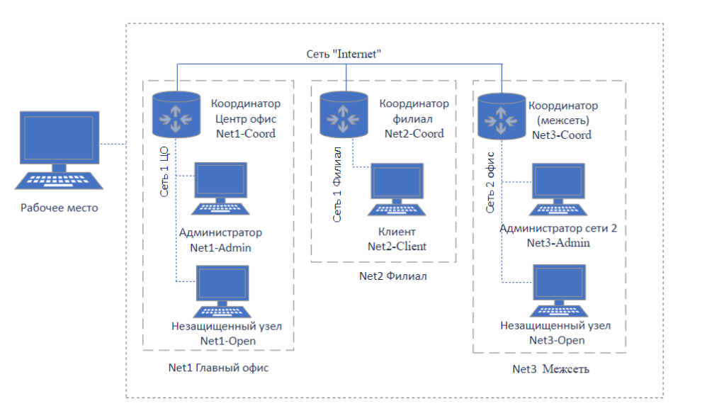

## Дополнительные материалы для выполнения демонстрационного экзамена по специальности 10.02.04 Обеспечение информационной безопасности телекоммуникационных систем

### Топология сети в соответствии с заданием

### Перечень сетей в соответствии с заданием:
- Центральный офис «Сеть 1 ЦО»: 192.10.10.0/27
- Офис филиал «Сеть 1 Филиал»: 110.110.10.64/28
- Офис сеть 2 «Сеть 2 Офис»: 172.16.128.128/25
- «Интернет» для всех координаторов: 200.100.100.0/24

### Импровизированная таблица сетевых параметров:

| Имя ВМ        | Адаптер     | IP-адрес       | Маска подсети        | Шлюз           |
| ------------- | ----------- | -------------- | -------------------- | -------------- |
| Net1-Coord    | /dev/vmnet0 | 200.100.100.1  | 255.255.255.0(/24)   | 200.100.100.3  |
|               | /dev/vmnet1 | 192.10.10.1    | 255.255.255.224(/27) | -              |
| Net1-Open     | /dev/vmnet1 | 192.10.10.2    | 255.255.255.224(/27) | 192.10.10.1    |
| Net1-Admin    | /dev/vmnet1 | 192.10.10.3    | 255.255.255.224(/27) | 192.10.10.1    |
| Net2-Coord    | /dev/vmnet0 | 200.100.100.2  | 255.255.255.0(/24)   | 200.100.100.1  |
|               | /dev/vmnet2 | 110.110.10.65  | 255.255.255.240(/28) | -              |
| Net2-Client   | /dev/vmnet2 | 110.110.10.66  | 255.255.255.240(/28) | 110.110.10.65  |
| Net3-Coord    | /dev/vmnet0 | 200.100.100.3  | 255.255.255.0(/24)   | 200.100.100.1  |
|               | /dev/vmnet3 | 172.16.128.129 | 255.255.255.128(/25) | -              |
| Net3-Open     | /dev/vmnet3 | 172.16.128.130 | 255.255.255.128(/25) | 172.16.128.129 |
| Net3-Admin    | /dev/vmnet3 | 172.16.128.131 | 255.255.255.128(/25) | 172.16.128.129 |
